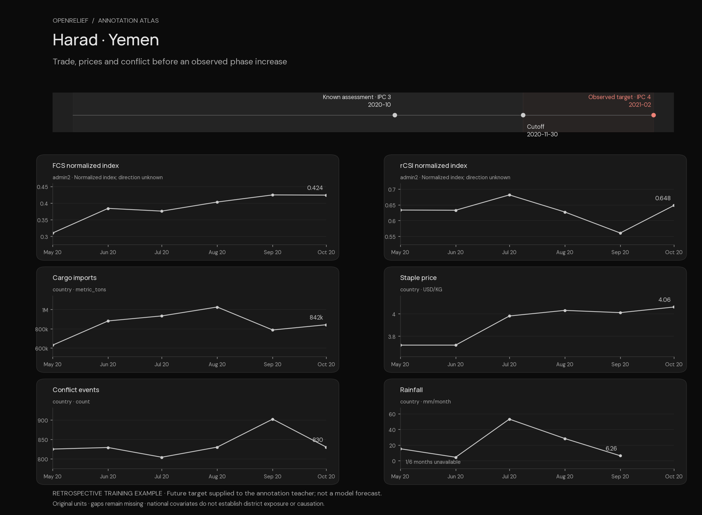
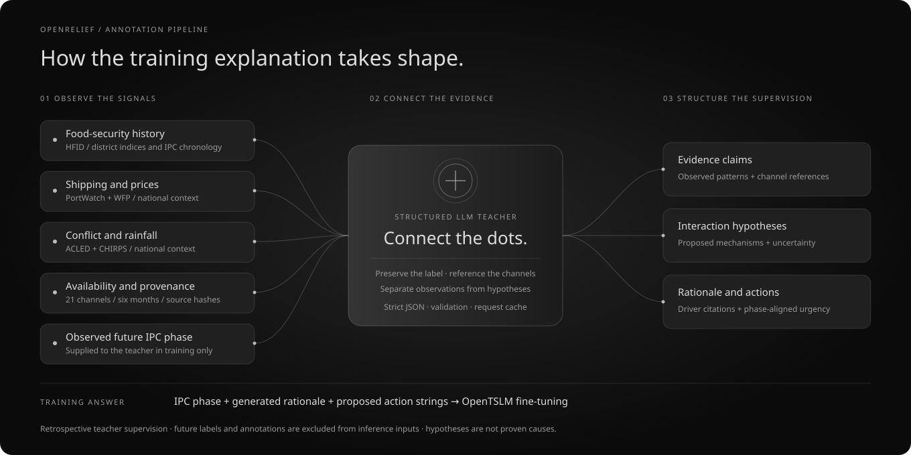
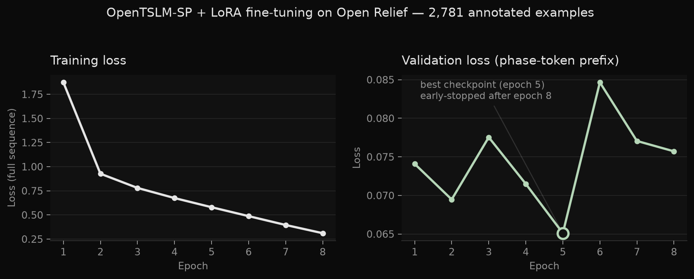

# Open Relief

**Connect food-security signals to explanations people can inspect.**

Open Relief explores district-level FEWS NET IPC phase forecasting **three months ahead**
from **six months of history**. It combines food-security indices, shipping, conflict,
rainfall and staple prices with OpenTSLM, then pairs the temporal task with language
supervision: evidence, cross-domain hypotheses, explanations and proposed actions.
The intended user is a food-security analyst reviewing districts and preparing follow-up.

Built for the **Aionic / ETH Agentic Systems Lab Temporal AI Challenge**, with reusable
TimeNet connectors and a focus on transparent, reproducible temporal reasoning.

[Annotation atlas](docs/examples/annotation-atlas/README.md) ·
[Dataset card](docs/DATASET_CARD.md) · [Current status](docs/STATUS.md) ·
[Submission plan](docs/PLAN.md) · [Data connectors](open-relief-data/README.md)

| Current snapshot | Evidence |
|---|---|
| 13,798 prepared examples; 21 monthly channels | 9,065 train / 2,503 validation / 2,230 test; integrity and temporal checks pass |
| 2,781 cached training annotations | 30.68% coverage; validated against the current schema |
| Four reusable TimeNet connectors | PortWatch, ACLED, WFP prices and CHIRPS; tested TimeF round trips |
| World-map frontend | Implemented in `frontend/`; chat panel calls the live fine-tuned checkpoint for 14 test-set countries, falls back to fixtures otherwise |
| Fine-tuned checkpoint | Retrieved, hashed, and serving live inference on Nebius; [PortWatch shipping signal](docs/FINDING-portwatch-signal.md) is the standout ablation result |
| Local tests | 25 passing at the documented readiness check |

## See the annotation pipeline



**Harad, Yemen:** the last available assessment was IPC 3; the observed training target
was IPC 4 in February 2021. The cached teacher connects changes in national rice prices,
cargo imports and conflict through explicitly uncertain hypotheses. This is a historical
training example, **not a prediction from the fine-tuned model**.

Explore [three complete examples with charts and verbatim generated arguments](docs/examples/annotation-atlas/README.md).
For the interactive offline gallery, open `docs/examples/annotation-atlas/index.html` in a browser.
The gallery uses existing endpoint responses and includes exact inputs, targets, channel
references, actions and request hashes. No new API calls are needed to render it.



The native TimeF exports and the modeling JSONL pipeline share acquisition logic. The
current GPU loader reads JSONL; it does not yet consume the TimeF exports directly.

## Web frontend

The React/Vite application lives in [`frontend/`](frontend/README.md), independently of the Python research pipeline. It is live at https://openrelief.vercel.app and currently displays **demo predictions**, not trained-model outputs.

```sh
cd frontend
npm ci
npm run dev
```

See the [frontend README](frontend/README.md) for build commands, Vercel configuration and the model integration handoff. For Git-connected Vercel deployments, set Root Directory to `frontend`. Python training remains a separate workflow.

## Current dataset

Prepared data mirrored on Hugging Face:
[Alaeddinnn/OpenRelief](https://huggingface.co/datasets/Alaeddinnn/OpenRelief).

| Partition | Rule | Examples |
|---|---|---:|
| Training | Target plus assumed release lag available by December 2022 | 9,065 |
| Validation | January–July 2023 cutoffs, labels available by July 2023 | 2,503 |
| Test | August–December 2023 cutoffs, exact target at cutoff +3 months | 2,230 |

Labels that cross the training or validation freeze are purged. The eligible validation
cutoffs therefore end in March 2023. Training spans 16 countries; test has 14, with no
eligible Yemen or Ethiopia examples. These are country-imbalanced retrospective samples,
not independent crisis events. Six complete monthly FCS/rCSI observations remain required.

There are **21 monthly channels**, with an availability mask for each at model input:

- FCS/rCSI normalized indices, and the requested plain `month_of_year` integers 1–12.
- Last known IPC phase and assessment age, reconstructed as of each historical month.
- Four PortWatch measures, ACLED events/fatalities, CHIRPS rainfall, WFP staple price.
- One- and three-month price percentage changes and FCS/rCSI differences, trailing
  three-month conflict events, and cargo imports relative to the previous three months.

Derived series use only the existing six-point window. Early entries without enough
history remain null, as do ratios with nonpositive denominators. No new downloads were
needed for these features. Source prefixes are retained so an ablation removes both a
source and its derived features. IPC history expires after six months without an assessment.

All non-calendar series are scaled to [-1,1] within each input window, with original scale
statistics and units retained in text. Calendar scaling is fixed from 1–12; there are no
sine/cosine channels. The official patch-size-4 collator pads six observations to eight
positions. Padding is a model operation, not extra observed months.

## Local setup and rebuilding

Use Python 3.12 for the complete TimeNet workflow:

```sh
python3.12 -m venv .venv
.venv/bin/python -m pip install -r requirements-local.lock.txt
.venv/bin/python -m pytest -q
bash scripts/rebuild_local.sh
```

`rebuild_local.sh` uses the already downloaded monthly artifacts and original HFID CSV.
It makes no API calls. To acquire fresh data, follow
[the separate acquisition project](open-relief-data/README.md). A fresh acquisition produces
three all-country monthly files; supply those three to `open_relief.enrich` instead of
mixing them with overlapping country-extension files from this workspace.

Inputs, objective targets, manifests and annotations are separate artifacts. Dataset
loading verifies checksums. `reports/dataset-validation.json` records sample counts,
country coverage, channel missingness and temporal checks.

## Annotation: evidence, hypotheses and proposed actions

Keep the official OpenAI API key in `.env`, following `.env.example`; never include it in
a handoff. The selected model is `gpt-5.6-terra`. It receives training records and their
objective future phase, using strict JSON output. Recalled context and inference are
separated from observed evidence; retrieved evidence is disabled unless actually supplied.
Annotations are retrospective supervision and never become inference inputs.

Each annotation also includes `recommended_actions`: concrete response recommendations
(e.g. market/price support, conflict-displacement coordination, water/irrigation support)
grounded in the same identified precursor/interaction drivers, not invented separately.
Every action must cite the channels behind it and an urgency (`monitor`, `prepare_now`,
`respond_now`) consistent with the standard IPC response framework for the objective
future phase. The fine-tuning target therefore trains the model to reason and recommend
an action together on annotated examples. The current six-example pilot and 2,781-row
training file contain actions; older artifacts without them are incompatible.
Structured provenance remains in the annotation record, while the training answer retains
the phase, rationale and action strings. The teacher sees the observed future label;
forecasting inputs do not.

```sh
# Small diverse live test; not the full training set.
bash scripts/annotate_local.sh pilot

# Optional continuation: uses the paid endpoint and resumes the existing cache.
bash scripts/annotate_local.sh full

# Validate the existing partial annotation file.
.venv/bin/python -m open_relief.validate artifacts/multimodal \
  --annotations artifacts/annotations-training.jsonl \
  --output reports/pretraining-validation.json

# Render the documented training examples offline.
.venv/bin/python scripts/build_annotation_showcase.py
```

Add `--require-complete-annotations` to validation only when checking full coverage.
It intentionally fails for the current 2,781/9,065 file. Finishing annotation is not a
prerequisite for the hackathon submission; the training owner controls the next run.

The full command selects all 9,065 training examples, uses eight workers, and stops before
a conservative $185 cache-wide accounting ceiling. It may finish fewer examples if that
ceiling is reached; check the output manifest. Keep `artifacts/annotation-cache` between
runs. Exact requests reuse cached responses, including after validation fixes. Budget
reservations persist for ambiguous API failures; automatic API retries are disabled.
Only one annotation process may own the cache at a time. Do not delete the cache to reset
spend accounting. Other API projects and old pre-ledger attempts are outside this ledger;
the margin below the user's $200 budget is intentional.

Validated schema and unchanged labels do not guarantee every explanation is factually
correct. Review numeric claims, assessment dates, national/local scope and causal language
on a sample before treating rationales as high-quality supervision. `confidence` is an
annotation-quality judgment, not calibrated forecast probability.

## GPU training and evaluation

The runner imports official OpenTSLM at commit
`2968f4b891baab4307f7e9d0043e87677b593a30`. It defaults to the official Llama 3.2 1B TSQA
SP checkpoint and records resolved checkpoint/backbone revisions and hashes. SP is the
initial practical choice, not an empirically established winner. The runner also supports
the official corresponding Flamingo checkpoint.

On a Linux CUDA machine, with Hugging Face access to Llama 3.2 1B configured:

```sh
bash scripts/setup_gpu.sh
bash scripts/train_gpu.sh artifacts/gpu-run
```

The training script requires a nonempty, matching annotation file. It first evaluates pretrained OpenTSLM,
then fine-tunes and evaluates the same 256 deterministically selected test IDs. Use a fresh
output directory per run. The direct CLI accepts `--eval-limit 100000` for the full held-out
partitions and `--checkpoint OpenTSLM/llama-3.2-1b-tsqa-flamingo` for the alternative.
`--annotations` is required; partial coverage is accepted and recorded. With the current
dataset, all 9,065 training examples are used, with empty rationale/action targets for the
6,284 unannotated examples. Record the actual remote code and dataset if using a smaller
annotated-only slice. `--skip-pretrain-eval` exists for resuming experiment workflows;
the final comparison still needs a separately documented pretrained baseline if claimed.

Training uses official architecture, collator, loss, LoRA and checkpoint methods, with
batch size one and gradient accumulation eight, maximum ten epochs, and patience three.
Validation uses phase JSON prefix loss, excluding retrospective rationale text. Outputs
include pretrained/fine-tuned raw predictions, country metrics, losses, checkpoint and a
before/after table. Generation validity is scored separately. GPU dependencies are pinned;
the training workstream owns remote runtime validation and delivery of its checkpoint.

**Headline finding:** ablating one input source at a time, [dropping IMF PortWatch shipping
data collapses macro-F1 from 0.72 to 0.58](docs/FINDING-portwatch-signal.md) — by far the
largest effect of any source tested, and the only ablation that hurts performance at all.
The model also starts flagging far more deterioration events once shipping is removed
(secondary-deterioration F1 jumps from 0.075 to 0.60), a sharp behavioral shift consistent
with shipping carrying a distinct, high-value signal none of the other sources provide.



The checkpoint (`best_model.pt`, SHA-256 `a10343caa152d1c3aa55b6dc9b40e11603067babeac44909001d1597a3e84e10`)
is retrieved to [artifacts/nebius/all-sources/](artifacts/nebius/all-sources/) and also
deployed as a live inference endpoint wired into the frontend chat panel — see
[SUBMISSION.md](docs/SUBMISSION.md).

For context: on the all-sources model's own 256-example cohort, recomputed persistence
scores **0.7276 macro-F1 / 0.7500 accuracy**, close to the fine-tuned model's 0.7199/0.7344 —
so the win here is the shipping-ablation signal and the working evidence-to-briefing
pipeline, not a demonstrated macro-F1 lead over the naive baseline. See
[the readiness analysis](docs/HACKATHON-READINESS.md) for the full comparison and limitations,
including the small subset's single phase-4 example.

## Evaluation, plots and transfer

```sh
.venv/bin/python -m open_relief.evaluate artifacts/multimodal
.venv/bin/python -m open_relief.ablation artifacts/multimodal --split validation
.venv/bin/python -m open_relief.demo artifacts/multimodal --output artifacts/demo-final
.venv/bin/python scripts/package_handoff.py
```

After training, pass `--predictions artifacts/gpu-run/fine_tuned.jsonl` to the demo command.
Without predictions, the two plots explicitly show input case studies with GPU forecasts
pending. They are selected by historical worsening, not prediction correctness.
The transfer archive includes code, documentation, prepared data and available annotations;
it excludes `.env`, virtual environments and raw download caches. Checkpoints and remote run
outputs need a separate explicit delivery path; see [the submission checklist](docs/SUBMISSION.md).
The repository's ignored `artifacts/` directory is not transferred by a Git push.

## Material limitations

Historical release timestamps and revisions are unavailable: HFID, PortWatch, ACLED and
WFP use an assumed one-month lag; CHIRPS uses two. This is a retrospective research
benchmark, not proof of real-time forecasting performance. Country-level external signals
are shared by districts; country-average rainfall is not district exposure. Shipping is
not food-specific, food prices depend on changing market composition, and FCS/rCSI
normalization direction is undocumented. Price coverage is about 73%, shipping 79%,
conflict 100%, rainfall 83% after lag masking. No missing observation becomes a real zero.

Classical ablations measure association rather than causation. Do not equate a three-month
forecast horizon with demonstrated warning lead time or claim additional data improve
forecasts until held-out experiments support it. Source terms and provenance are in
[the source inventory](docs/SOURCES.md) and acquisition manifests.
