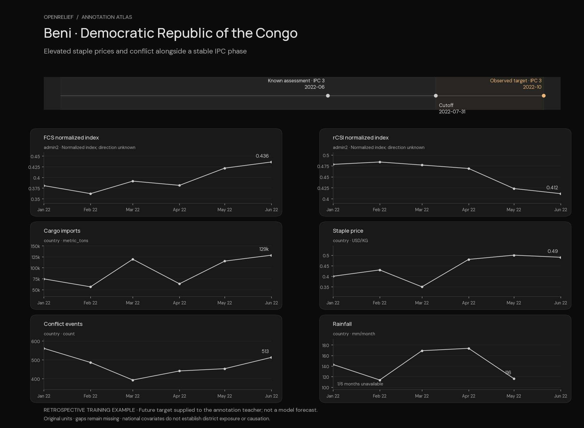
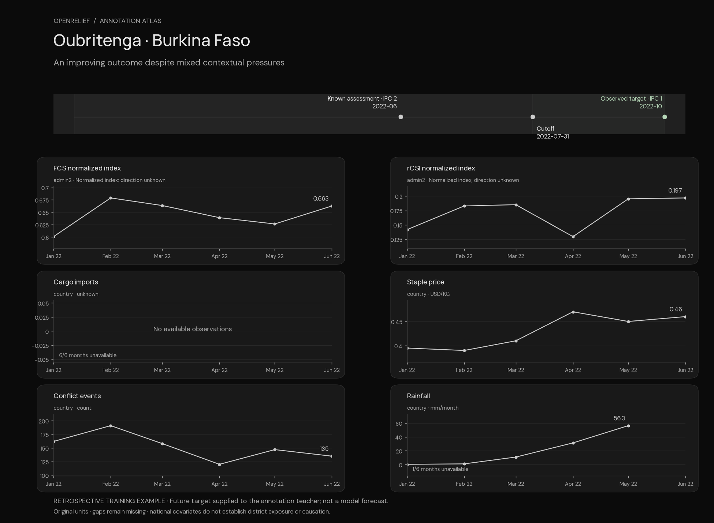

# Annotation atlas

Real time-series inputs and cached LLM-generated training annotations, rendered without new API calls.


Open [index.html](index.html) locally for the interactive gallery, or read the examples below on GitHub.

These three **training-partition** examples were selected editorially to illustrate deterioration,
persistent crisis and improvement across three countries. They are not a random quality sample,
held-out predictions, or evidence of model accuracy. The teacher was given each observed future
phase. Its language is preserved verbatim; hypotheses are not established causes.

The pipeline couples objective labels to signal descriptions, cross-domain hypotheses, a rationale,
driver-cited actions and uncertainty. Training retains the phase, rationale and action strings;
the richer provenance remains in the annotation artifact. Confidence describes annotation quality,
not forecast probability. [Exact example data](examples.json) · [Build manifest](manifest.json).

## Harad, Yemen — Deterioration

Cutoff **2020-11-30** · known IPC **3** → observed target **4** in **2021-02**.


**Generated rationale**

> Retrospectively, the supplied ground truth records deterioration by one IPC phase, from the latest available October 2020 phase-3 assessment to phase 4 in February 2021. Before that outcome, observed national rice prices rose, cargo-import volumes declined from an August peak, and conflict-event totals increased. The admin2 normalized FCS and rCSI values show numeric changes only; because their normalization direction is unknown, they are not interpreted as food-consumption or coping changes. National trade, price, and conflict correlations provide plausible contributing channels but are not district-level causal evidence.

<details>
<summary>Cross-domain hypotheses and proposed actions — verbatim teacher output</summary>

**Hypothesis (inference)**

The July–October rise in the national imported-rice price coincided with lower country-level cargo-import volumes after the August peak and with a subsequent observed move from the October phase-3 assessment to phase 4 in February 2021.

If the reduced aggregate cargo flow included commodities or inputs relevant to food markets, it could have compounded rising staple costs by tightening market availability or raising transaction costs, reducing household purchasing power and contributing to more severe food-security outcomes.

Channels: `wfp_staple_price`, `wfp_staple_price_change_3m_pct`, `portwatch_import_cargo`, `portwatch_import_cargo_vs_previous_3m_pct`, `last_available_phase`.

Uncertainty: This is a plausible trade-and-price mechanism, not a proven causal chain: imports are non-food-specific, both signals are national, and the phase-4 outcome is district-specific.

**Hypothesis (inference)**

High and increasing trailing national conflict-event counts during July–October overlapped with elevated imported-rice prices, before the observed February 2021 phase-4 outcome.

Conflict can plausibly disrupt movement, market functioning, livelihoods, and access to assistance; when staple prices are also elevated, these constraints may compound affordability and access pressures for households.

Channels: `acled_events`, `acled_events_sum_3m`, `wfp_staple_price`, `wfp_staple_price_change_3m_pct`, `last_available_phase`.

Uncertainty: No district-level conflict exposure, displacement, road-access, livelihood, or assistance-delivery observations are supplied, so this hypothesis cannot establish causation.

**Proposed action · respond_now**

Provide or scale up phase-4-appropriate emergency food assistance and/or cash or voucher support where markets can safely function, with transfer values reviewed against the imported-rice price series.

Rising observed staple prices may erode purchasing power, and the retrospective outcome is IPC phase 4.

Drivers: `wfp_staple_price`, `wfp_staple_price_change_1m_pct`, `wfp_staple_price_change_3m_pct`, `last_available_phase`.

**Proposed action · respond_now**

Strengthen monitoring of port-linked commodity flows, local market availability, and district retail prices; pre-position essential assistance where supply monitoring identifies constraints.

Aggregate cargo imports fell after August while rice prices remained elevated; monitoring is needed because port data are national and non-food-specific.

Drivers: `portwatch_import_cargo`, `portwatch_import_cargo_vs_previous_3m_pct`, `wfp_staple_price`, `last_available_phase`.

**Proposed action · respond_now**

Coordinate conflict-sensitive delivery arrangements, including access monitoring and safe, impartial distribution planning, while tracking whether conflict affects Harad market access or assistance delivery.

National conflict activity was persistently high, creating a plausible access risk alongside the phase-4 outcome, though local effects are unverified.

Drivers: `acled_events`, `acled_events_sum_3m`, `acled_fatalities`, `last_available_phase`.

</details>

Sample `3cbb32921fe1afe089e3977f` · cached teacher `gpt-5.6-terra`.

## Beni, Democratic Republic of the Congo — Persistent crisis

Cutoff **2022-07-31** · known IPC **3** → observed target **3** in **2022-10**.



**Generated rationale**

> The observed October outcome remained IPC Phase 3, matching the latest June Phase 3 assessment rather than showing a phase change. Measured precursors included an elevated cassava-flour price relative to March and a late increase in national conflict-event counts; the normalized FCS and rCSI series moved numerically in opposite directions in May-June, without interpretable welfare direction. These patterns may be relevant through market-access and purchasing-power channels, but their geographic aggregation and correlation do not establish causation.

<details>
<summary>Cross-domain hypotheses and proposed actions — verbatim teacher output</summary>

**Hypothesis (inference)**

The June increase in national conflict events (513; three-month total 1,407) coincided with cassava flour remaining near its May high (USD 0.49/kg in June after USD 0.50/kg in May).

Plausibly, conflict-related disruption to movement, market access, or livelihoods could compound elevated staple prices and constrain purchasing power, helping sustain acute food-security needs. This is a hypothesis rather than a demonstrated causal chain, particularly because conflict and price data are national while the IPC outcome is for Beni.

Channels: `acled_events`, `acled_events_sum_3m`, `wfp_staple_price`, `wfp_staple_price_change_3m_pct`, `last_available_phase`.

Uncertainty: Coincidence across aggregated national series does not prove that conflict caused the price level or the Phase 3 classification in Beni.

**Proposed action · prepare_now**

Prepare market monitoring and targeted purchasing-power support, such as time-bound staple vouchers or cash where market functionality and safety permit, with attention to cassava-flour affordability.

The identified country-level cassava-flour series was USD 0.49/kg in June and 40.0% above its March level on the reported three-month comparison; Phase 3 warrants preparation for response while verifying Beni-specific market conditions.

Drivers: `wfp_staple_price`, `wfp_staple_price_change_3m_pct`.

**Proposed action · prepare_now**

Prepare conflict-sensitive access and displacement coordination, including contingency planning for safe delivery routes and local market/access checks in Beni.

National conflict events rose in June after earlier declines, alongside a latest available Phase 3 assessment. National data do not identify Beni impacts, so local validation is necessary before operational prioritization.

Drivers: `acled_events`, `acled_events_sum_3m`, `last_available_phase`.

</details>

Sample `0029fa7cda0aa0fd84bee13c` · cached teacher `gpt-5.6-terra`.

## Oubritenga, Burkina Faso — Improvement

Cutoff **2022-07-31** · known IPC **2** → observed target **1** in **2022-10**.



**Generated rationale**

> The supplied assessment record shows a latest phase-2 assessment in June 2022 followed by the observed phase-1 outcome in October 2022. Before that outcome, national maize prices had risen materially over three months, conflict-event totals had declined but remained substantial, and rainfall increased through May. The admin2 normalized FCS and rCSI values fluctuated numerically, but their undocumented normalization precludes interpreting their direction as food-consumption or coping change. National market, conflict, and rainfall signals are contextual rather than district measurements and support hypotheses only, not causal conclusions.

<details>
<summary>Cross-domain hypotheses and proposed actions — verbatim teacher output</summary>

**Hypothesis (inference)**

Country maize prices remained 12.2% above their level three months earlier in June while national conflict-event totals over the preceding three months were still 402 events, despite declining from 511 in March.

Persistently higher staple prices could constrain purchasing power, while continuing conflict could disrupt movement, livelihoods, or market access. Together these pressures could have compounded household food-access risks, though the national signals cannot demonstrate a causal effect in Oubritenga.

Channels: `wfp_staple_price`, `wfp_staple_price_change_3m_pct`, `acled_events_sum_3m`.

Uncertainty: This is a plausible multi-domain mechanism, not proven causation; price and conflict data are national rather than district-specific.

**Hypothesis (inference)**

Rainfall increased through May while maize prices rose over January-April and remained elevated in May-June before the June 2022 phase-2 assessment; the supplied October outcome was phase 1.

Seasonal rainfall may support agricultural production or water availability over time, potentially offsetting some food-access pressure associated with elevated staple prices. This is only a possible explanation for the subsequent assessed phase change, not evidence that rainfall caused it.

Channels: `chirps_rainfall`, `wfp_staple_price`, `last_available_phase`.

Uncertainty: No local production, livelihood, or rainfall-anomaly data are supplied, and the October phase result cannot be attributed to these channels.

**Proposed action · monitor**

Maintain monthly Oubritenga market monitoring for white-maize availability and retail prices, with contingency planning for targeted price-sensitive assistance if local prices rise further or market access deteriorates.

National white-maize prices rose sharply through April and remained above January levels through June; local verification is needed because the observed October phase is 1 and the available price series is national.

Drivers: `wfp_staple_price`, `wfp_staple_price_change_1m_pct`, `wfp_staple_price_change_3m_pct`.

**Proposed action · monitor**

Maintain conflict-sensitive food-security surveillance and coordinate referral/access contingency arrangements for communities whose market access or livelihoods are disrupted by insecurity.

National conflict-event totals declined from their March rolling peak but remained 402 events over the three months ending June, with fatalities variable. District-level exposure should be verified before targeting.

Drivers: `acled_events`, `acled_events_sum_3m`, `acled_fatalities`.

</details>

Sample `002484ea2c5aaa22f62d46e8` · cached teacher `gpt-5.6-terra`.

## Rebuild

```sh
.venv/bin/python scripts/build_annotation_showcase.py
```

Requires the prepared dataset and existing training annotation file; no network access is used. Plots show six original channels out of 21, with original units and missing values preserved. The JSON contains all 21 channels, availability times and source hashes. Source attribution and reuse limitations are in [the dataset card](../../DATASET_CARD.md).
